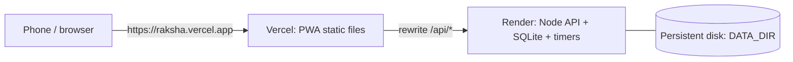

# 🛡️ Raksha — Women Safety PWA

Raksha is a mobile-first **Progressive Web App** (installable on Android and iPhone from the browser) that tackles five women-safety problems:

| # | Problem | How Raksha solves it |
|---|---------|----------------------|
| 1 | **Anonymous bystander harassment reporting with threshold-based escalation** | Account-free reports, PII scrubbing, location snapped to ~150 m cells, a risk engine with k-anonymity and per-device caps, and escalation records for authorities |
| 2 | **Reciprocal peer check-in circle for late-working women** | Safe Circles (invite codes), trip check-ins with staged alerts for missed check-ins, and “Are you okay?” nudges |
| 3 | **Location-share auto-expiry timer with pre-expiry reminder** | Expiring tracking links (`/t/<token>`), a reminder before expiry, extend/stop, and stop-on-arrival |
| 4 | **Incident report pre-filler and authority-specific draft generator** | Turns English/Hindi/Hinglish text into structured fields, and drafts complaints for Police, College ICC, Workplace IC (POSH), Transport, and Cybercrime |
| 5 | **Event-scoped group safety bubble for crowded gatherings** | Event codes, subzones, safe/need-help status, and subzone report counts with advisory and warning alerts |

> Raksha **never contacts police automatically**. Escalations go to the user’s circle and trusted contacts; authorities see only aggregated, anonymised patterns.

---

## ✨ Features

**For users**
- **Anonymous incident reports**
  - No account is needed. You choose the type, severity, frequency, tags, time, and approximate location.
  - Phone numbers, emails, Aadhaar/PAN numbers, vehicle plates, and names are scrubbed from descriptions.
  - Locations are snapped to an approximate area.
- **AI report assistance**
  - Turns English, Hindi, or Hinglish text into editable suggestions.
  - Generates editable complaint drafts for police, college, workplace, transport, or cybercrime.
  - Works **offline** (rule-based multilingual engine). If an API key is set, it can optionally use any OpenAI-compatible LLM, including free ones like Gemini or Groq ([setup](#-free-ai-api-key-optional)), or Azure OpenAI.
- **Report history**: view, open, and retract reports made from this device.
- **Safety map**: shows aggregated area risk levels, patterns (recurring time windows, recent bursts), and guidance. Areas with fewer than 3 independent reporting devices are hidden.
- **Safe Circles**: create or join a circle with an invite code, see each member’s check-in state, and send “Are you okay?” nudges.
- **Trip check-ins**
  - Start a trip, then check in as safe or delayed, ask for help, extend the ETA, mark arrived, or cancel.
  - Missed check-ins escalate in stages: you get a reminder first, then your circle is alerted, then your trusted contacts.
- **Temporary location sharing**
  - Expiring link plus QR code; share it with contacts or a circle.
  - Extend or stop it, or let it stop automatically when you arrive.
  - You get a reminder before it expires.
- **SOS**
  - One tap alerts selected contacts and circle members, and creates a live-location link.
  - Mark yourself safe to resolve it, or cancel it as a false alarm.
  - The screen has **112** and **181** call buttons.
- **Evidence vault**
  - Files are stored with AES-256-GCM encryption.
  - You can download them, re-verify their SHA-256 hash, and get an integrity certificate (printable HTML or JSON).
- **Event Safety Bubble**: join or organise an event, share a *safe* or *need help* status per subzone, and receive event risk alerts.
- **Trusted contacts**: add, edit, and remove contacts. Link a Telegram chat for automatic alerts; SMS and WhatsApp share fallbacks are also available.
- **Settings**
  - Voice Guard: keyword-triggered SOS, active while the app is open.
  - Watch areas, notification toggles, and Web Push.
  - Location, microphone, and notification permission checks.
  - Delete all my data.

**Safety and authority**
- **Risk engine**
  - Report-age decay (30-day half-life) and a severity × frequency weight.
  - A **per-device score cap**, so one person cannot flood an area.
  - k-anonymity (≥ 3 independent devices).
  - Recurring time-window and burst detection.
  - Escalation records.
- **Event risk alerts**: reports are counted per event subzone, and members are alerted when the advisory or warning thresholds are crossed.
- **Authority dashboard and API** (`/authority`, key-protected): patterns, escalations (acknowledge, mark actioned, or dismiss), a zone graph of adjacent hot cells, and analytics.

---

## 🚀 Quick start (local)

**Prerequisites:** **Node.js 22.13 or newer** (Node 24 recommended). Raksha uses the built-in `node:sqlite`, so no database install is needed.

```bash
npm install          # installs all three workspaces
npm run seed         # optional: demo data (reports, a Safe Circle, an event)
npm run dev          # API on :8080 + Vite dev server on :5173 (hot reload)
```

Open **http://localhost:5173**.

### Production-style run (single server)

```bash
npm run build        # builds the PWA into web/dist
npm start            # Fastify serves the API + the built app on :8080
```

Open **http://localhost:8080**. The server prints a banner with your LAN URL(s) and the **authority API key**.

### Demo mode (recommended for presentations)

In demo mode, 1 “minute” is 1 **second**. Trips, check-in escalations, share expiry, and reminders all happen live within seconds.

```bash
# macOS / Linux
DEMO_MODE=true npm start
# Windows PowerShell
$env:DEMO_MODE="true"; npm start
```

Or put `DEMO_MODE=true` in `.env` (copy `.env.example`).

| Demo data (after `npm run seed`) | Value |
|---|---|
| Safe Circle invite code | `DEMO42` |
| Event code | `FEST24` |
| Authority key | printed by `seed` and by the server banner (also in `server/data/authority.key`) |
| Seeded hot-spots | Bengaluru (MG Road, Majestic, Koramangala…), with 25+ reports and escalations |

To start over, run `npm run seed -- --reset`.

---

## 📱 Using it on a phone

Browsers only allow **GPS, notifications, the microphone, WebCrypto, and Add to Home Screen** on **HTTPS** origins (or `localhost`). Pick one of these options:

1. **Same Wi-Fi, quick look**
   - Run `npm run build && npm start`, then open the `Network:` URL from the banner (for example `http://192.168.1.20:8080`) on the phone.
   - The UI works, but GPS and push are blocked over plain HTTP. You can pick locations on the map manually instead.
2. **HTTPS tunnel (recommended for demos)**: expose port 8080 with any tunnel:
   ```bash
   npx cloudflared tunnel --url http://localhost:8080     # Cloudflare quick tunnel
   # or: devtunnel host -p 8080 --allow-anonymous         # Microsoft Dev Tunnels
   # or: ngrok http 8080
   ```
   Open the `https://…` URL on any phone. Set `PUBLIC_URL` to it if you want server-generated links to use it.
3. **Deploy** (see below) for a permanent HTTPS URL.

**Installing on the phone:**
- Android Chrome: open the menu, then choose **Install app** (or **Add to Home screen**).
- iPhone Safari: tap **Share**, then **Add to Home Screen**.

**Sharing with users:** send the HTTPS URL, or create a location share and let them scan the QR code it shows. To share the app itself, put the app URL into any QR generator. Anyone can view a tracking link (`/t/…`) **without installing anything**.

---

## ☁️ Hosting / deployment

Raksha is one Node process that serves both the API and the static PWA. Data lives in `DATA_DIR`: the SQLite DB, encrypted evidence, and keys.

### Azure App Service (Linux)
```bash
az webapp up --runtime "NODE:22-lts" --name raksha-<you> --sku B1
az webapp config appsettings set -n raksha-<you> -g <rg> --settings \
  DATA_DIR=/home/data PUBLIC_URL=https://raksha-<you>.azurewebsites.net \
  SCM_DO_BUILD_DURING_DEPLOYMENT=true
az webapp config set -n raksha-<you> -g <rg> --startup-file "npm run build && npm start"
```
`/home` is persistent storage on App Service.

### Vercel (web) + Render (API)

Vercel runs only static files and short-lived serverless functions. The Raksha API needs a **long-running process** for three things: the SQLite database, check-in, share-expiry and SOS escalation timers that run in the background, and encrypted evidence files on disk. So the recommended split is:

- **Vercel** serves the PWA from `web/dist`.
- **Render**, or Railway/Fly.io/Azure, runs the Node API with a persistent disk.
- Vercel **proxies `/api/*`** to the API. The browser sees a single origin, so no CORS setup is needed and the service worker and push work as usual.



**1. Deploy the API first (Render example)**
1. Push this folder to a GitHub repo.
2. Render → **New → Web Service** → pick the repo.
   - Runtime: Node.
   - Build command: `npm ci && npm run build`.
   - Start command: `npm start`.
3. **Disks → Add disk** with mount path `/var/data`. This needs a paid instance; without a disk, data is lost on every restart.
4. Environment variables:
   - `DATA_DIR=/var/data`
   - `PUBLIC_URL=https://<your-app>.vercel.app` (the **Vercel** URL, so share and tracking links point at the PWA)
   - `NODE_VERSION=22`
   - Optional: `DEMO_MODE`, `OPENAI_API_KEY` + `OPENAI_BASE_URL` + `OPENAI_MODEL` (free AI keys work, see [Free AI API key](#-free-ai-api-key-optional)), `TELEGRAM_BOT_TOKEN`, `MASTER_KEY`, `AUTHORITY_API_KEY` (see Configuration below). Push (VAPID) keys are generated automatically in `DATA_DIR`.
5. Note the API URL, for example `https://raksha-api.onrender.com`. Check `https://raksha-api.onrender.com/api/v1/meta` returns JSON.

**2. Deploy the PWA to Vercel**
1. Edit `vercel.json` in the repo root and replace `https://YOUR-RAKSHA-API.onrender.com` with your API URL. Commit and push.
2. Vercel → **Add New → Project** → import the same repo. Keep **Root Directory** as the repo root; `vercel.json` already sets these:
   - Install command: `npm ci`
   - Build command: `npm run build` (builds `web` only)
   - Output directory: `web/dist`
   - Rewrites: `/api/*` → your API, and all other routes → `index.html` so deep links like `/t/<token>` and `/map` work.
   - Headers: no-cache for `sw.js` and `index.html`, and long caching for hashed `/assets/*`.
3. Click **Deploy**. Alternatively, use the CLI:
   ```bash
   npm i -g vercel
   vercel          # first run links the project (preview deploy)
   vercel --prod   # production deploy
   ```
4. Open `https://<your-app>.vercel.app`. Vercel gives you HTTPS, so geolocation, install-to-home-screen, and push notifications all work on phones.

**Checks and gotchas**
- If `PUBLIC_URL` on the API isn't the Vercel URL, share links and QR codes will point at the Render host. They still work, because Render also serves the PWA, but users would see two different domains.
- Render's free tier sleeps when idle. A sleeping server delays check-in escalations until it wakes, so use an always-on instance for anything beyond a demo.
- If you redeploy and the phone shows an old UI, clear site data or reopen the PWA. The service worker refreshes pages network-first.
- **Not supported:** running the API itself as Vercel serverless functions. SQLite files and background timers do not persist there.

### Render / Railway / Fly.io
- **Build command:** `npm install && npm run build`
- **Start command:** `npm start`
- Attach a persistent disk and set `DATA_DIR` to it. Set `PUBLIC_URL`.

### Docker (any host)
```dockerfile
FROM node:22-slim
WORKDIR /app
COPY . .
RUN npm ci && npm run build
ENV DATA_DIR=/data PORT=8080
VOLUME /data
EXPOSE 8080
CMD ["npm","start"]
```

> Back up `DATA_DIR`. **`master.key` encrypts the evidence vault.** If it is lost, stored evidence cannot be decrypted.

---

## ⚙️ Configuration (`.env`)

Copy `.env.example` to `.env`. Every setting is optional.

| Variable | Default | Purpose |
|---|---|---|
| `PORT` / `HOST` | `8080` / `0.0.0.0` | Listen address |
| `DEMO_MODE` | `false` | 1 minute = 1 second for live demos |
| `DATA_DIR` | `server/data` | SQLite DB, evidence, keys |
| `PUBLIC_URL` | auto | Absolute base for generated links |
| `APP_TIMEZONE` | `Asia/Kolkata` | Used for recurring time-window patterns |
| `AUTHORITY_API_KEY` | auto-generated | Key for `/authority` + `/api/v1/authority/*` |
| `MASTER_KEY` | auto-generated | 64 hex chars; evidence encryption key |
| `MAX_EVIDENCE_MB` | `25` | Upload limit |
| `TELEGRAM_BOT_TOKEN`, `TELEGRAM_BOT_USERNAME` | — | Enables Telegram alerts to trusted contacts |
| `OPENAI_API_KEY`, `OPENAI_MODEL`, `OPENAI_BASE_URL` | — / `gpt-4o-mini` / `https://api.openai.com/v1` | Optional LLM for AI report structuring. Works with any OpenAI-compatible provider, including the free options below |
| `AZURE_OPENAI_ENDPOINT`, `AZURE_OPENAI_API_KEY`, `AZURE_OPENAI_DEPLOYMENT`, `AZURE_OPENAI_API_VERSION` | — | Azure OpenAI alternative |
| `VAPID_SUBJECT` | `mailto:raksha@example.com` | Web Push contact (VAPID keys are auto-generated) |

### 🆓 Free AI API key (optional)

**AI is optional.** Without a key, **AI report assistance** uses the built-in offline engine for English, Hindi and Hinglish. **Complaint drafts** always use templates and never need a key. An LLM only improves how free-text reports are turned into suggestions. Before anything is sent to the provider, the text is scrubbed of personal details (names, phone numbers, emails), and any LLM error or timeout falls back to the offline engine.

Raksha can call any **OpenAI-compatible** API. Set three variables in `.env` (local) or in your host's environment settings (Render/Azure, etc.):

| Provider (free tier) | Get a key | `OPENAI_BASE_URL` | `OPENAI_MODEL` (example) |
|---|---|---|---|
| **Google Gemini** (recommended) | [aistudio.google.com/apikey](https://aistudio.google.com/apikey) | `https://generativelanguage.googleapis.com/v1beta/openai` | `gemini-3.8-flash` |
| **Groq** | [console.groq.com/keys](https://console.groq.com/keys) | `https://api.groq.com/openai/v1` | `llama-3.3-70b-versatile` |
| **OpenRouter** (free models) | [openrouter.ai/keys](https://openrouter.ai/keys) | `https://openrouter.ai/api/v1` | any model ID ending in `:free` |

Example (`.env`, Gemini):
```env
OPENAI_API_KEY=your-gemini-key
OPENAI_BASE_URL=https://generativelanguage.googleapis.com/v1beta/openai
OPENAI_MODEL=gemini-3.8-flash
```

Then restart the server (`npm start`). The startup banner should show `AI: LLM + offline fallback`. To test, open **Report**, type something like *"kal raat bus mein ek aadmi ne ghoora aur peecha kiya"*, and tap **✨ AI: fill the form for me**. The suggestion box should say *language model* instead of *offline rules*.

Notes:
- Model names and free-tier limits change over time. Check the provider's model list (Gemini: [models](https://ai.google.dev/gemini-api/docs/models), Groq: [models](https://console.groq.com/docs/models)) and use a current ID. If you get HTTP 404 or 400 errors, the model ID is usually wrong.
- When a free tier hits its rate limit (HTTP 429), Raksha falls back to the offline engine for that request, so the app keeps working.
- Free tiers may use your prompts to improve their models (for example, Gemini's free tier). Text is scrubbed first, but use a paid or Azure OpenAI key for real deployments.
- Keep the key in `.env` or the host's secret settings only. `.env` is already in `.gitignore`, so never commit it.
- *GitHub Models is no longer an option; it was retired in July 2026.*

**Telegram setup (optional):**
1. Create a bot with [@BotFather](https://t.me/BotFather).
2. Set `TELEGRAM_BOT_TOKEN` and `TELEGRAM_BOT_USERNAME`.
3. In the app, go to **Contacts → Link Telegram** and send the link to your contact. Once they press *Start*, they receive SOS, trip, and share alerts automatically.

---

## 🧪 Testing

```bash
npm test             # vitest: 21 shared-logic tests + 10 API integration tests
npm run typecheck    # TypeScript across shared, server and web
```

---

## 🗂️ Project layout

```
shared/   Pure TypeScript domain logic + zod schemas (risk engine, PII scrubber, geohash, check-in stages, AI fallback)
server/   Fastify 5 API, node:sqlite, scheduler, notifications (Web Push + Telegram), evidence encryption, seed
web/      React 18 + Vite PWA (react-leaflet maps, service worker, Voice Guard, location tracker)
docs/     ARCHITECTURE.md, USER_GUIDE.md
vercel.json  Vercel config for hosting the PWA (proxies /api to the Node API)
```

- [docs/ARCHITECTURE.md](docs/ARCHITECTURE.md): components, data model, risk engine, escalation flows, security and privacy.
- [docs/USER_GUIDE.md](docs/USER_GUIDE.md): a step-by-step walkthrough of every feature, plus a 5-minute demo script.

## ⚠️ Disclaimer
Raksha is a hackathon prototype and is **not** a replacement for emergency services. In an emergency, call **112** (national emergency) or **181** (women helpline). For cybercrime, call **1930** or visit cybercrime.gov.in.
