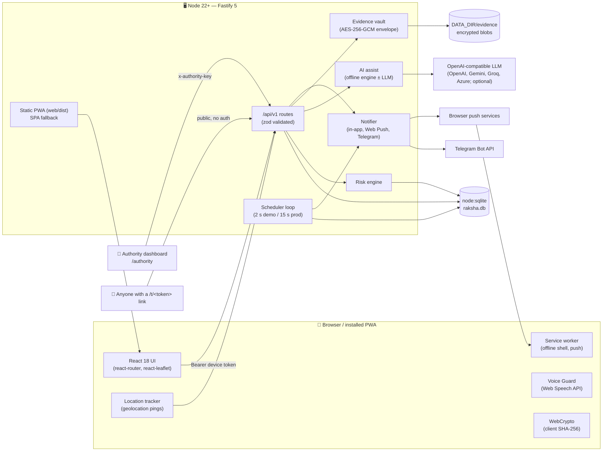
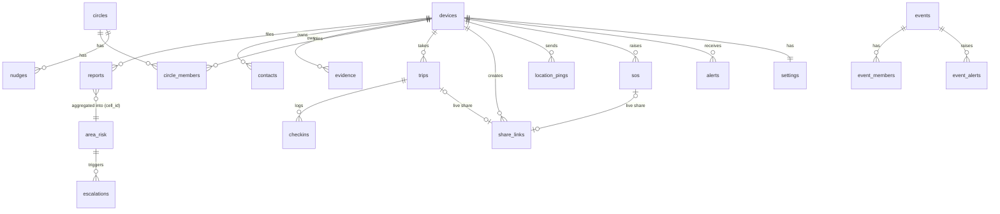
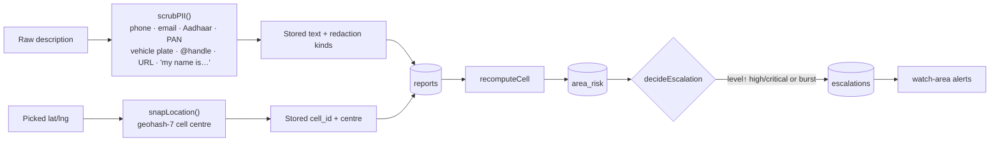
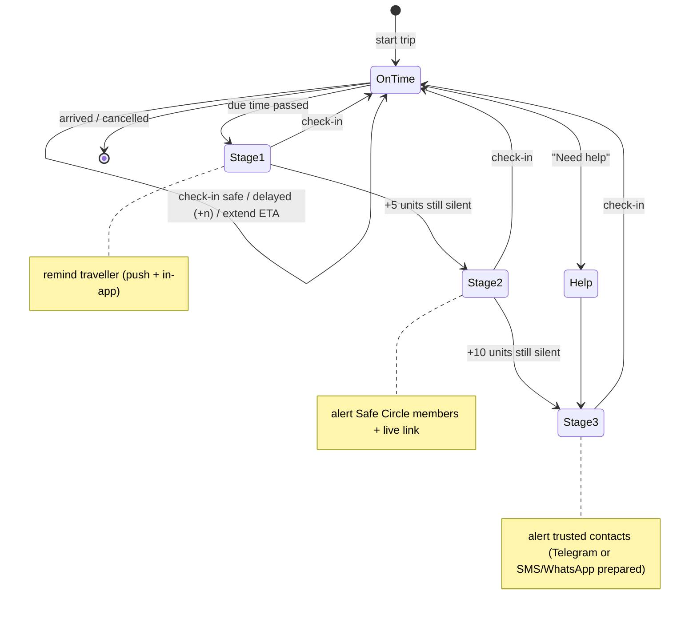
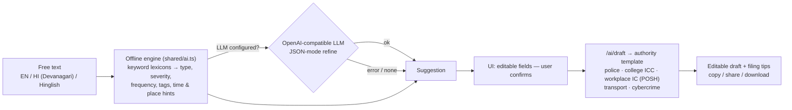

# Raksha — Architecture

## 1. Overview

Raksha is a **single deployable Node.js service** that serves both a REST API and a React **PWA**. Its domain logic lives in a shared TypeScript package, so the browser and the server use exactly the same rules for:
- PII scrubbing
- geohash snapping
- risk scoring
- check-in stages
- validation schemas



### Monorepo layout

| Package | Responsibility |
|---|---|
| `shared/` | Pure functions with no I/O: `privacy.ts` (PII scrubber, location snapping), `geohash.ts`, `risk.ts` (scoring, patterns, escalation decisions, guidance), `checkin.ts` (trip stages, share expiry state, event thresholds), `ai.ts` (offline multilingual structurer and complaint templates), `schemas.ts` (zod), `constants.ts`. Unit tested in `shared/test`. |
| `server/` | `app.ts` (Fastify build, CORS, rate limit, multipart, static and SPA fallback), `db.ts` (schema plus a thin `node:sqlite` helper), `context.ts` (config, db, notifier, clock), `scheduler.ts`, `services/*` (risk, safety, notify, evidence, ai), `routes/*`, `seed.ts`. Integration tested in `server/test`. |
| `web/` | Vite + React PWA. `api.ts` (device-token fetch), `state.tsx` (me/meta context), `tracker.ts` (pings while a trip, share or SOS is active), `voiceGuard.ts`, `push.ts`, `public/sw.js`, plus 16 pages in `pages/`. |

## 2. Identity and authentication

- **Users have no accounts.**
  - On first launch, the PWA generates a random 32-byte **device token** and stores it in `localStorage`.
  - Every request sends `Authorization: Bearer <token>`.
  - The server stores only the token's **SHA-256** and maps it to an internal `device_id`.
  - Reports are linked to this device id solely so that history, retraction and the per-device cap work. The id is never exposed to other users or to authorities.
- **Authorities** use a shared API key (`x-authority-key`), which is auto-generated into `DATA_DIR/authority.key` or set with `AUTHORITY_API_KEY`.
- **Public tracking links** (`/t/<token>`) use a random 128-bit token. They return 410 once expired or stopped.
- **Rate limiting:** 600 requests/min per IP (via `@fastify/rate-limit`).

## 3. Data model (SQLite)



Key points:
- `reports` holds the **snapped** `cell_id` (7-character geohash, about 150 m) and its centre `lat/lng`. It also holds the scrubbed description, a `redactions` list, and `retracted_at`.
- `area_risk` is a materialised per-cell result: score, level, visibility, distinct device count, and patterns JSON. It is recomputed on every report or retraction, and periodically so that age decay is applied.
- `share_links` stores `expires_at`, `reminder_sent`, `stop_on_arrival` and an optional `trip_id`/`sos_id`. `location_pings` holds the trail.
- `kv` stores VAPID keys, the Telegram update offset, and the seed flag.

## 4. Risk engine (Problem 1)

All of the logic below lives in `shared/src/risk.ts`, which makes it deterministic and unit tested.

```
weight(report) = (severity / 5) × freqMult(once 1, repeated 1.25, ongoing 1.5) × 0.5^(ageDays / 30)
score(cell)    = Σ over devices of min( Σ weights of that device's reports , deviceCap = 2.0 )
visible(cell)  = distinct reporting devices ≥ 3          (k-anonymity)
level          = critical ≥ 5 · high ≥ 3 · moderate ≥ 1.5 · else low
```

- **Per-device cap:** one person, or one malicious device, can add at most 2.0 points to a cell. This blocks spam-driven escalation.
- **Recurring pattern:** at least 3 reports on at least 3 different local days, falling in the same time window (late night, morning, afternoon, evening or night, in `APP_TIMEZONE`), within 60 days.
- **Burst:** at least 4 reports within 24 h. It stays "active" for 72 h.
- **Escalation (threshold-based):** an escalation record is created when a visible cell's level **rises** to *high* or *critical*, or when a burst becomes active. Each reason is deduplicated per cell for 24 h.
- **What authorities see:** escalations in the dashboard, which they can acknowledge, mark actioned or dismiss, with a note. Raksha never pushes anything to police.
- **Watch-area alerts:** users with a watch area covering an escalated cell receive an in-app/push notification.
- **Zone graph:** visible cells at moderate or above become nodes. Neighbouring geohash cells are joined by edges, and connected components are reported as *clusters*.
- **Safety guidance:** generated from the level, the recurring window, any burst, and the dominant incident type.

**Report privacy pipeline** (runs on the server, so nothing raw is ever stored):



On the map, the API returns **only cells that are visible**, so cells below k-anonymity never leave the server.

## 5. Trip check-ins and Safe Circles (Problem 2)

Due time = `min(nextCheckinAt, etaAt + 10 units)`. The scheduler computes how overdue a trip is and escalates **one stage at a time**. Stages are never skipped silently.



- 1 unit is 1 minute in production and 1 second in `DEMO_MODE`.
- Nudges ("Are you okay?") are reciprocal. Any member can nudge any other member. The recipient answers either *I'm okay* or *Need help*; *Need help* alerts the circle and starts sharing their location.
- The circle view shows each member's state: idle, on trip, overdue, help or SOS.

## 6. Expiring location shares (Problem 3)

- `POST /shares` creates a link with `expires_at`, gives it a token, and notifies the selected circles and contacts.
- While any share, trip or SOS is active, the PWA tracker pings `/location/ping`. The UI also checks `/location/needed`.
- On each scheduler tick, `shareLinkState()` returns one of:
  - `active`
  - `reminder_due` (10 units before expiry): push a reminder to the owner (*extend or let it stop*)
  - `expired`: the link is closed and `/public/share/:token` returns **410**
- **Stop on arrival:** arriving at a trip closes its linked share.
- Extending a share resets `reminder_sent`.
- Trails older than the share are not exposed. A public link reveals only the display name, label, latest fix and recent trail.

## 7. AI report assistance (Problem 4)



- Before any text goes to an LLM, it is passed through `scrubPII`.
- The offline engine always works, so the feature is still available without internet or API keys.
- Drafts include placeholders (e.g. `[Police Station name]`), relevant legal references (for example BNS sections and the POSH Act) and filing tips.

## 8. Event Safety Bubble (Problem 5)

- An organiser creates an event with a centre, radius, time window, subzones (circles on the map) and thresholds (default advisory 3, warning 6). Attendees join with the event code.
- A report with `eventId` is attributed to the nearest subzone that contains its location, or to the subzone the user chose.
- `newlyCrossedThresholds(count, thresholds, alreadyRaised)` raises each level once per subzone. The resulting alerts go to all members (in-app plus push) and are listed in the event's alert history.
- A member's status (*safe* / *need help*, plus subzone) is visible to the other members. *Need help* alerts every other member of the event, so the organisers and volunteers can respond.

## 9. SOS, contacts and notifications

- `POST /sos` creates an SOS row and a live share. It then notifies:
  - the selected circle members (in-app and push)
  - the selected contacts: via Telegram if linked, otherwise the response includes a prepared `smsText` that the UI offers as `sms:` / WhatsApp / native share
- Resolving or cancelling the SOS closes the share and informs the same people.
- **The Notifier** writes an `alerts` row (the in-app inbox, polled by the PWA) and attempts Web Push (VAPID keys are auto-generated). For contacts, it uses the Telegram Bot API.
- **Telegram linking:** the app creates a `t.me/<bot>?start=<code>` link, and the scheduler long-polls `getUpdates` to bind the chat id.
- **Voice Guard** uses the browser Web Speech API while the app is open and listens for the configured keywords. On a match it opens `/sos?trigger=voice`, which starts a cancellable 5-second countdown.

## 10. Evidence vault

```mermaid
sequenceDiagram
  participant P as PWA
  participant S as Server
  participant F as DATA_DIR/evidence
  P->>P: SHA-256(file) via WebCrypto
  P->>S: multipart (clientSha256, note, file)
  S->>S: sha256(buffer) — must equal clientSha256
  S->>S: random DEK → AES-256-GCM(file); DEK wrapped with MASTER_KEY (AES-256-GCM)
  S->>F: ciphertext blob
  S-->>P: id, sha256, receivedAt
  P->>S: download → decrypt → re-hash → verify
  P->>S: certificate?format=html → printable integrity certificate
```

- The certificate records the file name, size, MIME type, SHA-256, server receipt time, a verification instruction, and an HMAC signature computed with a key derived from the master key.

## 11. Authority API

All of these endpoints are under `/api/v1/authority/` and require the `x-authority-key` header.

| Endpoint | Returns |
|---|---|
| `GET patterns?minLevel=&type=&days=` | Visible cells with level, score, device count, patterns, guidance |
| `GET escalations?status=` · `POST escalations/:id/ack {status, note}` | Escalation queue and workflow (open → acknowledged → actioned/dismissed) |
| `GET zone-graph` | Nodes, adjacency edges, clusters |
| `GET analytics?days=` | Totals, by type, severity, hour bucket, day, tags; level distribution |
| `GET events` | Events with live subzone counts and alerts |

Only aggregates are returned: no device ids, no raw locations, and no report text for cells below k-anonymity.

## 12. Full API surface (`/api/v1`)

- **Account:**
  - `GET/PUT/DELETE /me`
  - `GET/PUT /settings`
  - `GET /alerts`, `POST /alerts/read`
  - `POST/DELETE /push/subscribe`, `POST /push/test`
- **Contacts:**
  - `GET/POST /contacts`, `PUT/DELETE /contacts/:id`
  - `POST /contacts/:id/telegram-link`, `POST /contacts/:id/telegram-test`
- **Reports:**
  - `POST /reports`, `GET /reports/mine`, `GET /reports/:id`, `POST /reports/:id/retract`
  - `GET /map/areas`, `GET /map/areas/:cellId`
  - `POST /ai/structure`, `POST /ai/draft`
- **Circles and trips:**
  - `POST /circles`, `POST /circles/join`, `GET /circles`, `GET /circles/:id`
  - `POST /circles/:id/leave`, `POST /circles/:id/nudge`
  - `GET /nudges`, `POST /nudges/:id/respond`
  - `POST /trips`, `GET /trips`, `GET /trips/active`
  - `POST /trips/:id/{checkin|extend|arrive|cancel}`
- **Sharing and SOS:**
  - `POST/GET /shares`, `POST /shares/:id/{extend|stop}`
  - `POST /location/ping`, `GET /location/needed`
  - `POST /sos`, `GET /sos/active`, `POST /sos/:id/{resolve|cancel}`
  - `GET /public/share/:token` (no auth)
- **Evidence:**
  - `POST/GET /evidence`, `GET /evidence/:id/download`
  - `POST /evidence/:id/verify`, `GET /evidence/:id/certificate`, `DELETE /evidence/:id`
- **Events:**
  - `POST /events`, `POST /events/join`, `GET /events`, `GET /events/:id`
  - `POST /events/:id/status`, `POST /events/:id/leave`
- **Meta:** `GET /health`, `GET /meta`

## 13. Security and privacy summary

| Concern | Mitigation |
|---|---|
| Reporter identity | No accounts; only a hashed device token is stored; device id never exposed |
| Personal details in text | Server-side `scrubPII` before storage and before any LLM call |
| Exact location | Snapped to geohash-7 cell centre (~150 m) before storage |
| Small-area re-identification | k-anonymity (≥ 3 distinct devices) for map and authority views |
| Spam / brigading | Per-device score cap, rate limiting, zod validation |
| Stalking via share links | Unguessable token, hard expiry, pre-expiry reminder, stop on arrival, 410 after stop |
| Evidence tampering / leakage | AES-256-GCM envelope encryption, SHA-256 checked end to end, signed certificate |
| Right to erasure | `DELETE /me` removes the device's reports, evidence, shares, trips, circles, contacts and settings |
| Police involvement | Never automatic: humans in the loop (circle, contacts, authority dashboard) |

## 14. Deviations from the original plan

- **`node:sqlite` (built into Node 22.13+) instead of Prisma:** no native build step and zero-config setup on Windows, macOS and Linux.
- **Hand-written service worker** (`web/public/sw.js`) instead of `vite-plugin-pwa`: smaller, and it handles push and notification clicks explicitly.
- **PWA instead of native Android:** chosen for hackathon speed. It installs to the home screen, and tracking links work in any browser. Limitation: background GPS and Voice Guard only run while the app is open. A native wrapper (Capacitor/TWA) is the path to background operation.
- **HTTPS requirement:** browsers block geolocation, push, microphone, WebCrypto and install on non-localhost HTTP. Use a tunnel or a deployment for phone testing (see README).
